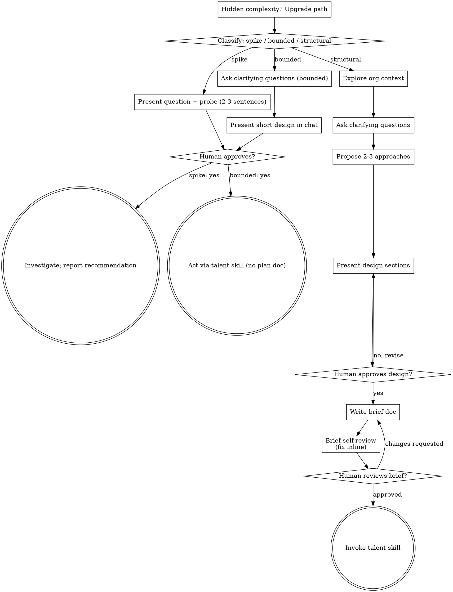

# Discovering Needs Into People Designs

Turn raw people requests into fully formed designs through natural collaborative dialogue.

Start by classifying how much process the request needs, then work
through your path: understand the context, refine the need, present a
design, and get your human partner's approval.

## Establish Shared Understanding

The outcome of discovery is an understanding your human partner can
recognize and correct, grounded in what they want to accomplish for their people.

1. **Discover intent.** Use the request and available context to identify
   the intended outcome, who it is for, and what success looks like. When
   that information is missing, ask one focused question about purpose or
   intended impact before proposing roles, programs, or an approach. Knowing the department does not tell you why your partner wants it. Gathering missing requirements does not ask them to authorize the task again.
2. **Write back your understanding.** Summarize the intended outcome,
   relevant constraints (budget, headcount, timeline, legal, culture), and success criteria in a short note your partner
   can assess. Separate what they said from assumptions. Invite correction
   and incorporate their answer before treating this as the design brief.
3. **Carry intent into the design.** Preserve the agreed understanding in
   the selected path's design artifact: the written brief for structural
   work, or the in-chat design/probe for bounded work and spikes. Check
   proposed roles, policies, and people choices against that understanding.

When the request already supplies the purpose and constraints, reflect
that understanding instead of asking the same questions again. Keep the
note concise; its accuracy and the opportunity to correct it matter.

<HARD-GATE>
Before taking any talent action, including invoking a talent skill,
writing a job description, defining a scorecard, changing compensation,
restructuring a team, or announcing any people decision, complete the
selected path's prerequisites:

- Spike: the human partner approves the question and probe.
- Bounded: the human partner approves the short in-chat design.
- Structural: the human partner reviews and approves the written brief,
  then reviews the written action plan and selects its execution
  method. Conversational design approval only permits writing the brief;
  written-brief approval only permits invoking the talent skill.

A reply approves the stage actually presented. Approval of an idea or
program scope does not approve artifacts that do not exist yet. Resume
at the earliest incomplete stage; do not turn one approval into permission
to skip the rest of the selected path. Read-only org exploration is
allowed while those prerequisites remain incomplete.
</HARD-GATE>

## Three Paths

Before your first question, classify the request and say the
classification out loud — "this looks bounded, so I'll present a short
design here rather than write a brief" — so your human partner can
override it:

- **Spike** — a feasibility question ("can we...", "is it possible...",
  "what does the market pay for...") whose output is an answer, not a decision you
  keep. Present the question and what you'll check in 2-3 sentences, get
  a nod, then find out as cheaply as correctness allows. No design
  doc, no brief file. Report findings as a recommendation; anything you
  drafted stays labeled throwaway.
- **Bounded** — a well-scoped change to something that already exists in
  this org: a one-role backfill with an existing scorecard, a single policy tweak, a one-person development action.
  Understanding the department is not enough — bounded means the role, policy, or program you are changing is already here to read. If there is no existing baseline to change, the task is not bounded. Ask the clarifying
  questions that matter, present a short design IN CHAT (a few
  sentences to a few short paragraphs), and STOP. Action
  starts only after your human partner says yes to that design — a
  bounded task's approval is as hard a gate as a structural
  one. No brief file, no action plan document.
- **Structural** — new teams, new roles from scratch, new performance or compensation systems, changes that reshape how people fit together or alter expectations others depend on. Follow the full process: questions, approaches, sectioned design, written brief, then the talent skill.

When in doubt between two paths, take the heavier one. The ratchet is
one-way: hidden complexity discovered mid-task upgrades the path —
stop, say so, and step up. Nothing downgrades mid-task.

## Anti-Pattern: "Too Simple To Need Approval"

Every path ends with your human partner approving the required design
before action. A bounded change may need only two sentences in
chat. A new department is structural and requires the written
brief and talent handoffs. Scale the artifact to the selected path;
complete that path's reviews before acting.

## Guardrails (non-negotiable)

MUST:
1. Capture budget, headcount, timeline, legal, and culture constraints in the brief before any talent action.
2. Name the data + privacy handling for the initiative: what PII is touched, who sees it, TTL, deletion.
3. New programs, policies, teams, or compensation systems go structural: written brief + approval + talent skill. No shortcuts.
4. Metrics over vanity: headcount, attrition by cause/cohort, time-to-hire, engagement, diversity, pay equity, training completion, ER cases.

NEVER:
1. Approving scope that touches protected classes, medical/biometric data, or cross-border transfers without Legal in the design.
2. Greenlighting headcount without budget owner + HR sign-off path named.
3. Downgrading structural to bounded to skip the brief.
4. Collecting employee data "just in case" without purpose + TTL.

ESCALATE immediately to CHRO/CPO + Legal + protect confidentiality:
- Initiative triggers restructuring, redundancy, safety, harassment, discrimination, breach, or legal-claim risk.
- Log the escalation in the brief before proceeding.

## Red Flags

| Thought | Reality |
|---------|---------|
| "This is too simple to need a design" | Follow the selected path: a bounded change gets a short chat design; a structural change gets the written brief and talent handoffs. |
| "I'll call it bounded and skip the brief" | Reaching for a label to skip work IS the doubt — take the heavier path. |
| "It's bounded and the hire is obvious — I'll post the job while they read it" | The gate is the approval, not the design's length. Present, then stop until you hear yes. |
| "I understand this kind of role, so it's bounded" | Bounded measures the org, not your familiarity. A new role has no existing scorecard — it is structural. |
| "The spike answered it, so I'll announce the change" | A spike's output is an answer. Announcing is a new request — classify it. |
| "It grew, but I'm almost done — no need to re-classify" | Hidden complexity upgrades the path mid-task. Stop and say so. |
| "They approved exploring, so the hire is approved too" | Each task gets its own classification and its own approval. |
| "It's just one backfill, no scorecard needed" | Every hire without a scorecard is bias with a job title. Bounded still needs scorecard confirmation. |

## Checklist

Classify first, announce the path, then create a task for each item on
your path and complete them in order.

**Spike:**
1. **Explore org context** — enough to frame the probe
2. **Present question + probe plan** — 2-3 sentences
3. **Get approval** — a nod is enough
4. **Investigate** — as cheaply as correctness allows
5. **Report findings** — a recommendation; label anything drafted as throwaway

**Bounded:**
1. **Explore org context** — check roles, policies, recent decisions
2. **Ask clarifying questions** — one at a time, the ones that matter
3. **Present short design in chat** — approach, people touched, how you verify fairness
4. **Get approval** — STOP and wait for an explicit yes; presenting the design and acting in the same breath is skipping the gate
5. **Act** — proceed with the matching talent skill; no plan document

**Structural:**
1. **Explore org context** — check roles, policies, recent decisions
2. **Ask clarifying questions** — one at a time, understand purpose/constraints/success criteria
3. **Propose 2-3 approaches** — with trade-offs and your recommendation
4. **Present design** — in sections scaled to their complexity, get approval after each section
5. **Write brief** — save to `docs/people/briefs/YYYY-MM-DD-<topic>-brief.md` and commit
6. **Brief self-review** — quick inline check for placeholders, contradictions, ambiguity, scope (see below)
7. **Human partner reviews written brief** — ask them to review the brief file before proceeding
8. **Transition to talent skill** — invoke the matching talent skill (hiring-talent, reviewing-performance, shaping-culture, growing-talent)

## Process Flow

**Terminal states are path-bound.** Structural: the ONLY skill you
invoke after discovering-needs is the matching talent skill (hiring-talent, reviewing-performance, shaping-culture, growing-talent) — never jump straight to announcing. Bounded: after
approval, action proceeds directly through the matching
talent skill; no plan document. Spike: the terminal state is a
reported recommendation.

## The Process

The subsections below serve the bounded and structural paths (a
spike stops at "present the probe, get a nod"). Sections from
**Exploring approaches** onward are structural-path depth — for
bounded work, context plus a few questions plus a short in-chat design
is the whole process.

**Understanding the need:**

- Check the current org state first (roles, policies, recent decisions)
- Before asking detailed questions, assess scope: if the request describes multiple independent teams (e.g., "hire a sales org with SDRs, AEs, enablement, and ops"), flag this immediately. Don't spend questions refining details of a program that needs to be decomposed first.
- If the program is too large for a single brief, help decompose into sub-initiatives: what are the independent pieces, how do they relate, what order? Then run the first sub-initiative through the normal design flow. Each sub-initiative gets its own brief → talent skill cycle.
- For appropriately-scoped needs, ask questions one at a time to refine the need
- Prefer multiple choice questions when possible, but open-ended is fine too
- Only one question per message - if a topic needs more exploration, break it into multiple questions
- Focus on understanding: purpose, constraints, success criteria

**Exploring approaches:**

- Propose 2-3 different approaches with trade-offs (e.g., hire vs. promote vs. fractional vs. redistribute)
- Present options conversationally with your recommendation and reasoning
- Lead with your recommended option and explain why
- YAGNI ruthlessly - remove unnecessary roles, levels, and process from every approach and design

**Presenting the design:**

- Once you believe you understand what the org needs, present the design
- Scale each section to its complexity: a few sentences if straightforward, up to 200-300 words if nuanced
- Ask after each section whether it looks right so far
- Cover: role/team shape, success profile, compensation band, sourcing, selection bar, onboarding, risks
- Be ready to go back and clarify if something doesn't make sense

**Design for clarity and fairness:**

- Break the initiative into smaller units that each have one clear purpose, defined success criteria, and can be understood and evaluated independently
- For each role or policy, you should be able to answer: what outcome does it own, how is it measured, and who does it serve?
- Can someone understand what success looks like without insider context? Can you change the scope without breaking expectations? If not, the boundaries need work.
- Smaller, well-bounded roles are also easier to hire for - you interview better when the scorecard fits in context at once, and your decisions are more reliable when criteria are focused.

**Working in existing orgs:**

- Explore the current structure before proposing changes. Follow existing levels, bands, and rituals.
- Where existing setup has problems that affect the work (e.g., overlapping ownership, unclear levels, tangled reporting), include targeted improvements as part of the design - the way a good people leader fixes what they touch.
- Don't propose unrelated reorgs. Stay focused on what serves the current goal.

## After the Design (structural path)

**Documentation:**

- Write the validated design (brief) to `docs/people/briefs/YYYY-MM-DD-<topic>-brief.md`
- Commit the brief document to git

**Brief Self-Review:**
After writing the brief document, look at it with fresh eyes:

1. **Placeholder scan:** Any "TBD", "TODO", incomplete sections, or vague expectations? Fix them.
2. **Internal consistency:** Do any sections contradict each other? Does the team shape match the role descriptions?
3. **Scope check:** Is this focused enough for a single talent skill cycle, or does it need decomposition?
4. **Ambiguity check:** Could any expectation be interpreted two different ways? If so, pick one and make it explicit.
5. **Fairness check:** Could any criterion filter out qualified people for reasons unrelated to the work? If so, rewrite it.

Fix any issues inline. No need to re-review — just fix and move on.

**Human Review Gate:**
After the review loop passes, ask the human partner to review the written brief before proceeding:

> "Brief written and committed to `<path>`. Please review it and let me know if you want to make any changes before we move to the talent skill."

Wait for the response. If they request changes, make them and re-run the review loop. Only proceed once approved.

**Talent skill:**

- Invoke the matching talent skill to execute (hiring-talent, reviewing-performance, shaping-culture, growing-talent)
- Do NOT jump to announcing. The talent skill is the next step.
