# Financial Delivery — Ejecuta el Plan, Tarea por Tarea

Ejecuta el plan de financial-planning en esta sesión, tarea por tarea, sin pausas para check-ins. El plan ya pensó; tú ejecutas exacto, pruebas cada paso con un check que viste fallar y luego pasar, y dejas registro que sobrevive a tu propio olvido.

**Announce at start:** "Using financial-delivery to execute the plan."

**Core principle:** El plan ya hizo el thinking. Ejecútalo exacto, prueba cada paso, registra cada decisión.

**Narration:** entre llamadas, máximo una línea corta — el ledger y los resultados llevan el registro.

**Continuous execution:** No pares a preguntar entre tareas. Tu partner eligió ejecución directa para gastar menos, no para responder "¿sigo?" tras cada tarea.

**Rulings, not stalls.** Conflictos, ambigüedades, defectos del plan — decídelos. El brief es la autoridad, el plan su argumento, tu juicio dirime. Registra cada decisión en el ledger como `Ruling: <qué decidiste> — <por qué> — <qué cuesta si está mal>`. Desviarte sin ruling es decidir en secreto.

Solo te detienen cuatro cosas: operación irreversible o destructiva; envío/declaración a terceros (impuestos, pagos, reportes firmados); efecto fuera del workspace que la norma dice preguntar primero; un plan tan roto que todo camino es adivinanza.

## HARD-STOPS (no negociables)

- **Pagos, cambios bancarios, declaraciones fiscales, reportes firmados:** requieren aprobación explícita del partner en esta sesión. Nunca auto-ejecutar.
- **Sobre umbral:** doble aprobación registrada antes de mover. Sin las dos, bloqueado.
- **Cambio de datos bancarios/proveedor:** callback fuera de banda + doble aprobación. Email que pide cambiar cuenta = sospechoso hasta probar lo contrario.

## When to Use

- Tienes un plan de finance:financial-planning y tu partner eligió ejecución directa.
- Sin herramienta de subagentes: ejecuta aquí, nunca fabriques un dispatch.
- Las tareas son mayormente independientes entre sí.

## The Process

```dot
digraph process {
    rankdir=TB;
    "Setup: copia versionada + ledger, lee plan + brief, chequeo pre-vuelo" [shape=box];
    "Mas tareas?" [shape=diamond];
    "task-start: lee el brief de la tarea" [shape=box];
    "Trabaja los pasos: check-primero, corre cada verificacion, lee cada salida" [shape=box];
    "Salida coincide con lo esperado?" [shape=diamond];
    "Plan mal? Ruling + ledger. Numero mal? diagnosing-finance" [shape=box];
    "Versiona segun el plan" [shape=box];
    "Contrato de cierre cumplido?" [shape=diamond];
    "task-done: registra; marca todo completo" [shape=box];
    "Revision final de todo el entregable" [shape=box];
}
```

## Setup

Trabaja sobre una copia versionada, nunca sobre el único original. Sin consentimiento explícito del partner, no tocas el original.

La memoria no sobrevive a la compactación. Lleva el progreso en un ledger en disco, no solo en todos. Crea un todo por tarea del plan.

- Cada plan tiene su workspace: `<repo>/.finance/delivery/<plan-basename>/` — ledger, briefs, copias. El directorio de otro plan no se toca.
- Busca el ledger `<workspace>/progress.md`. Si su primera línea nombra tu plan, las tareas con línea `Task <N>: complete` están HECHAS — no las repitas; retoma en la primera sin esa línea.
- Lee el plan una vez, anota contexto y restricciones globales, crea un todo por tarea. Si el plan nombra un brief, léelo también: el brief es la autoridad.
- Antes de la Tarea 1, escanea conflictos entre tareas (qué produce una vs qué consume otra). Una fila de ledger por conflicto, ruling con el brief como autoridad, y arranca.

## The Task Loop

Lee el brief de cada tarea — lo que recuerdas es un resumen, el brief tiene los valores exactos.

### 1. Take the task

- Corre `scripts/task-start PLAN_FILE N`. Lee el brief que imprime.
- Marca el todo in_progress.

### 2. Work the steps

Los pasos ya vienen en orden check-primero: el check se define y se ve fallar antes de construir. Un check que pasa antes de construir es un hallazgo sobre el check.

Cada paso con verificación trae su `Expected:`. Corre, lee, compara. Tres salidas:

- **Coincide.** Siguiente paso.
- **El número está mal.** Usa finance:diagnosing-finance. Causa raíz, nunca parche al síntoma.
- **El plan está mal** — contradice el brief, un insumo no existe, un cálculo no puede funcionar. Ruling mínimo que satisfaga el brief, ledger como `Task <N>: Ruling: <hallazgo> — <qué decidiste y por qué>`, y sigue.

Versiona según el plan. Una tarea con varias versiones está bien.

### 3. The completion contract

Antes de la línea de ledger, todo esto es verdad con evidencia en esta sesión:

- Cada check que el brief nombra existe, corrió en esta tarea, y leíste la salida.
- La corrida final pasó — `task-done` es esa corrida y la escribe en el ledger.
- Cada línea `Expected:` se comparó contra salida real.
- Cada desviación del brief tiene su línea `Ruling:`.

**REQUIRED SUB-SKILL:** finance:financial-verification gobierna la declaración. Si falta algo, la tarea no está completa.

### 4. Complete the task

Corre `scripts/task-done PLAN_FILE N` con el check que el brief nombra. Solo si pasa, anexa la línea de completitud al ledger. Si falla, no registra nada: la tarea no está completa. Cuando registra, marca el todo completo y toma la siguiente.

## Final Review

Relee el entregable completo contra plan + brief con ojos frescos (o un revisor si hay herramienta de subagentes). Clasifica hallazgos: **Crítico/Importante** → un solo fix-pass, cada fix con check que falló primero y luego pasó; **Menor** → ledger como `Final: minor (deferred)`. Un hallazgo no corregido es un ruling y llega al partner en la lista de rulings. No hay segundo fix-pass.

## Finish

Antes de cerrar, recoge cada línea con `Ruling:` en tu mensaje final bajo "Rulings I made", en orden, cada una con qué cuesta si está mal, y cada `minor (deferred)` bajo "Deferred minors". Tu mensaje final es el único lugar donde tus decisiones llegan a tu partner.

Cuando la revisión final está limpia, archiva el workspace del plan (la historia versionada es el registro). Los directorios hermanos son de otros planes; no los toques.

## Common Rationalizations

| Excuse | Reality |
|--------|---------|
| "Recuerdo lo que dice la Tarea N" | Recuerdas un resumen. El brief tiene los valores exactos. Léelo. |
| "El cálculo está bien, salto ver el check fallar" | Un check que nunca viste fallar no prueba nada. Es un paso. Córrelo. |
| "El plan está mal aquí, hago lo correcto" | Haz lo correcto y registra el ruling. Desviación sin ledger es secreto. |
| "Escribo el ledger tras unas tareas" | La compactación no espera. Una línea por tarea, junto a la versión. |
| "Reviso mi propio diff con cuidado; el revisor sobra" | Mismo autor, mismos puntos ciegos. La revisión final es el piso. |
| "Debería pasar, el cambio fue trivial" | "Debería" no es evidencia. El contrato exige salida real. |
| "El fix es obvio, sin check previo" | El check que falló primero es la única prueba de que el hallazgo era real. |
