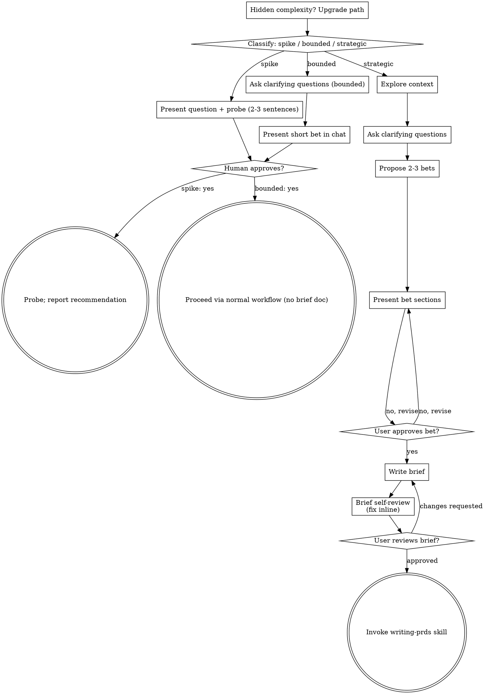

# Product Discovery — From Idea to Validated Bet

Turn raw ideas into a validated bet through collaborative dialogue. No PRD, no build, no launch plan until the bet is sharp.

Start by classifying how much process the request needs, then work the path: understand the outcome, surface assumptions, present the bet, get approval.

## Establish Shared Understanding

The outcome of discovery is an understanding your human partner can recognize and correct, grounded in what they want to accomplish.

1. **Discover intent.** Use the request and available context to identify the intended outcome, who it is for, and what success looks like. When that information is missing, ask one focused question about purpose or intended use before proposing features or an approach. Knowing the market category does not tell you why your partner wants this. Gathering missing requirements does not ask them to authorize the task again.
2. **Write back your understanding.** Summarize the intended outcome, relevant constraints, and success criteria in a short note your partner can assess. Separate what they said from assumptions. Invite correction and incorporate their answer before treating this as the brief.
3. **Carry intent into the bet.** Preserve the agreed understanding in the selected path's artifact: the written brief for strategic work, or the in-chat bet for bounded work and spikes. Check proposed scope and validation choices against that understanding.

When the request already supplies the purpose and constraints, reflect that understanding instead of asking the same questions again. Keep the note concise; its accuracy and the opportunity to correct it matter.

<HARD-GATE>
Before taking any shaping action, including invoking a shaping skill, drafting a PRD, sizing effort, designing pricing, or planning a launch, complete the selected path's prerequisites:

- Spike: the human partner approves the question and probe.
- Bounded: the human partner approves the short in-chat bet.
- Strategic: the human partner reviews and approves the written brief, then reviews the PRD and selects its validation method. Conversational approval only permits writing the brief; written-brief approval only permits invoking writing-prds.

A reply approves the stage actually presented. Approval of an idea or scope does not approve artifacts that do not exist yet. Resume at the earliest incomplete stage; do not turn one approval into permission to skip the rest of the selected path. Read-only exploration (docs, data, competitors) is allowed while those prerequisites remain incomplete.
</HARD-GATE>

## Three Paths

Before your first question, classify the request and say the classification out loud — "this looks bounded, so I'll present a short bet here rather than write a brief" — so your human partner can override it:

- **Spike** — a feasibility question ("will users pay for...", "is there demand for...", "quick check is fine") whose output is an answer, not something you ship. Present the question and what you'll probe in 2-3 sentences, get a nod, then find out as cheaply as correctness allows. No brief, no PRD. Report findings as a recommendation; anything probed stays labeled throwaway.
- **Bounded** — a well-scoped change to a bet that already exists in this repo: a copy tweak, a plan tier rename, a one-screen onboarding fix. Understanding the market is not enough — bounded means the flow you are changing is already here to read. If there is no existing bet to change, the task is not bounded. Ask the clarifying questions that matter, present a short bet IN CHAT (a few sentences to a few short paragraphs), and STOP. Shaping starts only after your human partner says yes — a bounded task's approval is as hard a gate as a strategic one. No brief file, no PRD.
- **Strategic** — new products, new segments, changes that reposition how value fits together or alter promises others depend on. Follow the full process: questions, options, sectioned bet, written brief, then the writing-prds skill.

When in doubt between two paths, take the heavier one. The ratchet is one-way: hidden complexity discovered mid-task upgrades the path — stop, say so, and step up. Nothing downgrades mid-task.

## Anti-Pattern: "Too Simple To Need Approval"

Every path ends with your human partner approving the required bet before shaping. A bounded change may need only two sentences in chat. A new product is strategic and requires the written brief and PRD handoffs. Scale the artifact to the selected path; complete that path's reviews before shaping.

## Jobs-To-Be-Done Lens

Every path answers these three, scaled to the path:

1. **Job:** what progress is the user hiring this product to make? ("When ___, I want ___, so I can ___.")
2. **Struggle:** what is broken, slow, or expensive about today that makes this job worth paying for?
3. **Success:** what observable user behavior proves the job got done? (Not vanity metrics — a behavior with a timestamp.)

If you cannot state the job in one sentence, you are not ready to present the bet.

## Riskiest Assumption First

Before presenting the bet, name the assumptions in this order and attack the riskiest:

1. **Desirability** — does anyone want this enough to switch behavior?
2. **Viability** — can we charge enough, often enough, to sustain it?
3. **Feasibility** — can we deliver it at acceptable cost?
4. **Usability** — can the target user succeed without help?

State which assumption is riskiest and why. The bet's validation probes that one first.

## Red Flags

| Thought | Reality |
|---------|---------|
| "This is too simple to need discovery" | Follow the selected path: a bounded change gets a short chat bet; a strategic change gets the written brief and PRD handoffs. |
| "I'll call it bounded and skip the brief" | Reaching for a label to skip work IS the doubt — take the heavier path. |
| "It's bounded and obvious — I'll draft while they read it" | The gate is the approval, not the bet's length. Present, then stop until you hear yes. |
| "I understand this market, so it's bounded" | Bounded measures the repo, not your familiarity. A new bet with no existing flow is strategic. |
| "The spike validated, so we'll ship it" | A spike's output is an answer. Shipping it is a new request — classify it. |
| "It grew, but I'm almost done — no need to re-classify" | Hidden complexity upgrades the path mid-task. Stop and say so. |
| "They approved the idea, so the PRD is approved too" | Each stage gets its own approval. |

## Checklist

Classify first, announce the path, then create a task for each item on your path and complete them in order.

**Spike:**
1. **Frame the question** — what decision does the answer unblock?
2. **Present question + probe plan** — 2-3 sentences
3. **Get approval** — a nod is enough
4. **Probe** — cheapest evidence that answers the question (5 interviews, landing test, concierge, data cut)
5. **Report findings** — a recommendation; label anything built as throwaway

**Bounded:**
1. **Explore context** — docs, metrics, recent decisions
2. **Ask clarifying questions** — one at a time, the ones that matter
3. **State JTBD + riskiest assumption** — one sentence each
4. **Present short bet in chat** — job, change, success behavior, probe
5. **Get approval** — STOP and wait for an explicit yes
6. **Proceed** — normal product workflow; no brief document

**Strategic:**
1. **Explore context** — docs, metrics, competitors, recent decisions
2. **Ask clarifying questions** — one at a time, purpose/constraints/success criteria
3. **Propose 2-3 bets** — with trade-offs and your recommendation
4. **Present bet** — in sections scaled to complexity, approval after each section
5. **Write brief** — save to `docs/product/specs/YYYY-MM-DD-<topic>-brief.md` and commit
6. **Brief self-review** — placeholders, contradictions, scope, ambiguity (see below)
7. **User reviews written brief** — review the file before proceeding
8. **Transition to PRD** — invoke writing-prds skill to create the PRD

## Process Flow

**Terminal states are path-bound.** Strategic: the ONLY skill you invoke after discovery is writing-prds — never pricing-packaging, go-to-market, or any other lifecycle skill. Bounded: after approval, work proceeds directly; no brief document. Spike: the terminal state is a reported recommendation.

## Rules — problem, evidence, sources (binding)

These rules win over any other instruction in this skill on conflict. A brief that violates them is returned, not filed:

1. **Problem statement present.** One written statement — user + moment + cost of status quo. In the user's words with source attached; unattributed framing labelled hypothesis. Missing statement = no brief, no PRD. Non-goals live in the statement.
2. **Discovery fields on every artefact.** Brief and every killed hypothesis carry `qué aprendimos` + `a quién hay que avisar`. Missing either = returned, not filed.
3. **Sources tokenised.** No names, emails, or account IDs anywhere — `SEG-042` style tokens only. Notes declare purpose, TTL, deletion and DSR route.
4. **Disagreement check.** A probe returning only agreement is a broken instrument — fix the method, don't report the result.
5. **North-star exists.** One outcome metric per product, written before the first PRD. If none exists, writing it is step zero of this discovery — not a follow-up.

## After the Bet (strategic path)

**Documentation:**

- Write the validated bet (brief) to `docs/product/specs/YYYY-MM-DD-<topic>-brief.md`
- Commit the brief to git

**Brief Self-Review (guardrails first):**

0. **Rules gate:** problem statement with user + moment + cost present? `qué aprendimos` + `a quién hay que avisar` filled? Sources tokenised? North-star exists or is written as step zero? Any NO = brief returned, not filed — fix before continuing to items 1-4 below.
1. **Placeholder scan:** Any "TBD", "TODO", incomplete sections, or vague outcomes? Fix them.
2. **Internal consistency:** Do any sections contradict each other? Does the JTBD match the success behavior?
3. **Scope check:** Is this focused enough for a single PRD, or does it need decomposition?
4. **Ambiguity check:** Could any outcome be interpreted two different ways? Pick one and make it explicit.

Fix any issues inline. No need to re-review — just fix and move on.

**User Review Gate:**

> "Brief written and committed to `<path>`. Please review it and let me know if you want to make any changes before we write the PRD."

Wait for the user's response. Only proceed once the user approves.

**Shaping:**

- Invoke the writing-prds skill to create the PRD
- Do NOT invoke any other skill. writing-prds is the next step.
